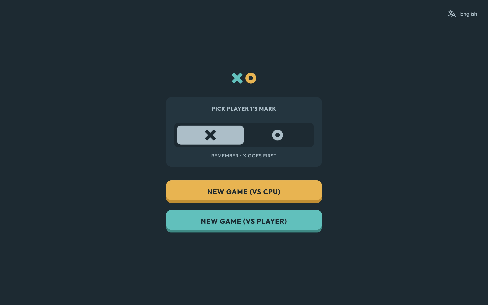
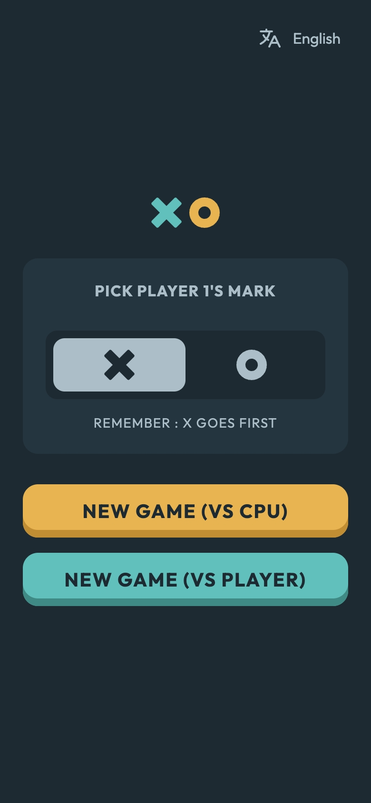
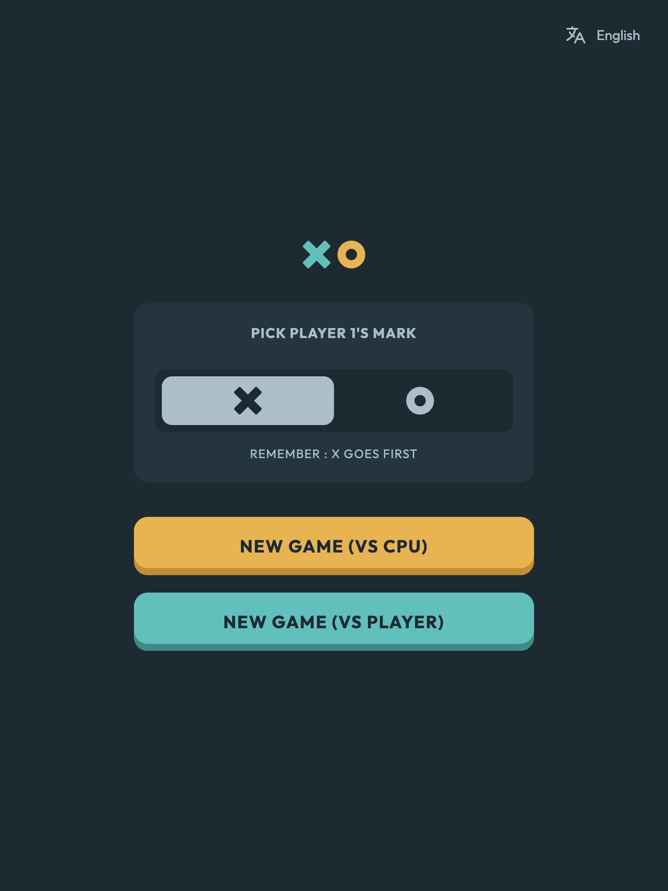

# Frontend Mentor - Tic Tac Toe solution

This is a solution to the [Tic Tac Toe challenge on Frontend Mentor](https://www.frontendmentor.io/challenges/tic-tac-toe-game-Re7ZF_E2v). Frontend Mentor challenges help you improve your coding skills by building realistic projects.

## Table of contents

- [Frontend Mentor - Tic Tac Toe solution](#frontend-mentor---tic-tac-toe-solution)
  - [Table of contents](#table-of-contents)
  - [Overview](#overview)
    - [The challenge](#the-challenge)
    - [Screenshot](#screenshot)
    - [Links](#links)
  - [My process](#my-process)
    - [Built with](#built-with)
    - [What I learned](#what-i-learned)
    - [Continued development](#continued-development)
  - [Author](#author)

## Overview

### The challenge

Users should be able to:

- View the optimal layout for the game depending on their device's screen size
- See hover states for all interactive elements on the page
- Play the game either solo vs the computer or multiplayer against another person
- **Bonus 1**: Save the game state in the browser so that it’s preserved if the player refreshes their browser
- **Bonus 2**: Instead of having the computer randomly make their moves, try making it clever so it’s proactive in blocking your moves and trying to win

Expected behaviors:

- On the new game screen, whichever mark isn't selected for the first player is automatically assigned to the second player when the game is started.
- The first turn of the first round is always played by whoever is playing as X. For every following round, the first turn alternates between O and X.
- After a round, if the player chooses to quit the game, they should be taken back to the new game menu.
- If the restart icon in the top right is clicked, the "Restart game?" modal should show and allow the player to reset the game or cancel and continue to play.

### Screenshot

Desktop

Mobile

Tablet

### Links

- [Live Site URL](https://tic-tac-toe.frilly.dev/)

## My process

### Built with

- [Astro](https://astro.build/)
- [Tailwind CSS](https://tailwindcss.com/)
- [SolidJS](https://www.solidjs.com/)
- [Nanostores](https://github.com/nanostores/nanostores)
- [@nanostores/persistent](https://github.com/nanostores/persistent)
- [@nanostores/i18n](https://github.com/nanostores/i18n)

### What I learned

- I learned to use the `nanostores/i18n` library to create dynamic translations for the website, instead of using page based routings.
- I learned that there's `client:only` directive to completely disable SSR for a component. Sometimes a component doesn't render well on SSR, so for now, I think it's better to disable it. There might be a way to make it so the component rerenders on a client mount, but this doesn't seem to trigger a rerun of the component.

### Continued development

- Definitely had a lot of fun utilizing `nanostores/i18n` and would like to continue to do so, since it feels much better than copying pages for translations.

## Author

- Website - [frilly.dev](https://frilly.dev)
- Frontend Mentor - [@hikawi](https://www.frontendmentor.io/profile/hikawi)
- Twitter - [@frillymissy](https://www.twitter.com/frillymissy)
